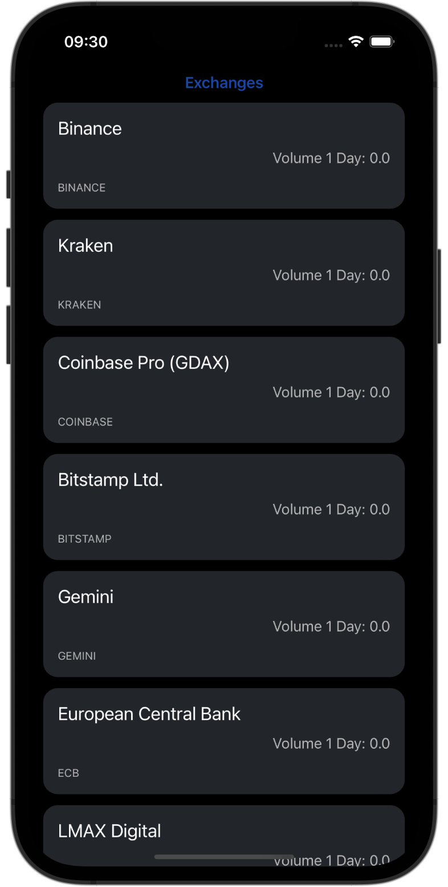
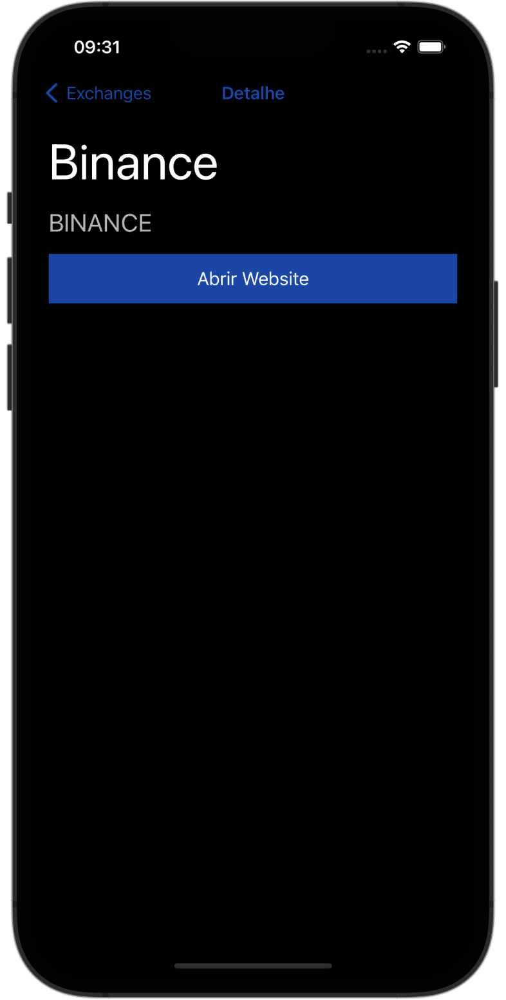
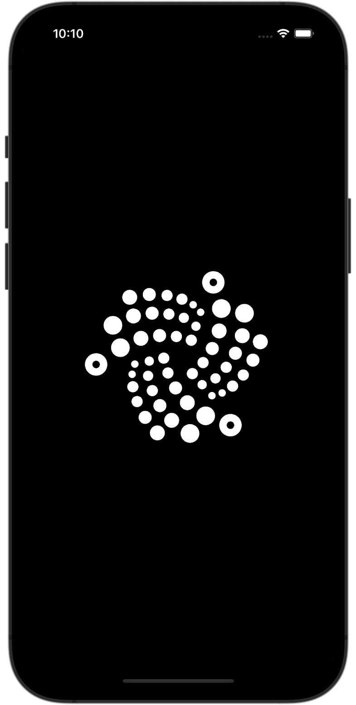

# CryptoApp

Aplicativo voltado para o acompanhamento das Exchanges de Crypto. Todas as informações presentes são retirados da Api <a href="https://www.coinapi.io" target="_blank">CoinAPI.io</a>.

## Home

Na Home do App é exibido uma lista de todas as exchanges.

## Tela de Detalhe

Quando é selecionado alguma exchange na tela de Home, é direcionado para a tela que apresenta mais detalhes daquela exchange, em que é permitido acessar o seu website

## Launch Screen

## Gerenciador de Dependências

Nesse projeto não foi utilizado nenhum gerenciador de Dependências.

## Detalhes Técnicos

Para esse projeto foi utilizado:
- Xcode 14.2
- Swift 5
- ViewCode
